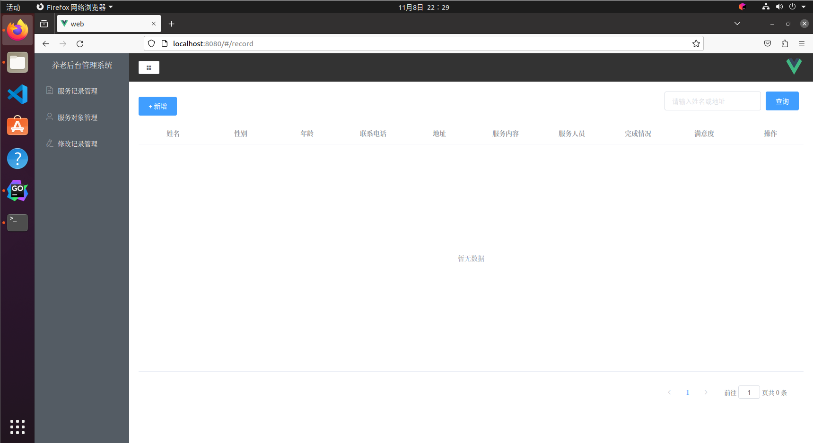

# e-service

使用fabric-sdk-go搭建的养老服务记录管理系统，前端采用ue+element-ui+axios架构，后端采用gin框架结合fabric区块链，并引入badger数据库作账号管理，数据在后端进行存储的时候采用AES加密算法进行加密，保证隐私；支持数据修改历史查询，向区块链提交的数据修改历史可以通过前端编辑历史界面调用后端智能合约中api完成。

## 项目代码

* [GitHub](https://github.com/shuai2077/e-service)

## 前端界面


## 快速启动

1. ubuntu20.04下配置最小开发环境：
    * fabric2.2版本
    * go1.18
    * docker&&docker-compose
    * npm&&node
    * vue&&vue cli

2. 启动docker

   打开命令行，输入以下命令
    ```bash
    cd e-service/fixtures/
    docker-compose up -d
    ```

3. 在ide中对项目进行调试，并进入终端启动服务管理系统前端

   打开命令行，输入以下命令
    ```bash
    cd e-service/web/
    npm run serve
    ```
   此时，浏览器打开，输入网址`http://localhost:8080/`, 此时进入管理后台登录页面，管理员角色与用户角色已在项目中预设，后续也可根据自己的需求开发账号管理功能。

4. 关闭docker

   打开命令行，输入以下命令
    ```bash
    cd e-service/fixtures/
    make
    ```

## 声明

> 1. 本项目仅用于学习练习
> 2. 本项目还不完善，仍处在开发中，不承担任何使用后果
> 3. 本项目代码开源[MIT](./LICENSE)，项目文档采用 [署名-禁止演绎 4.0 国际协议许可](https://creativecommons.org/licenses/by-nd/4.0/deed.zh)

## 致谢

本项目为合作完成的成果，感谢在项目中付出的每个人